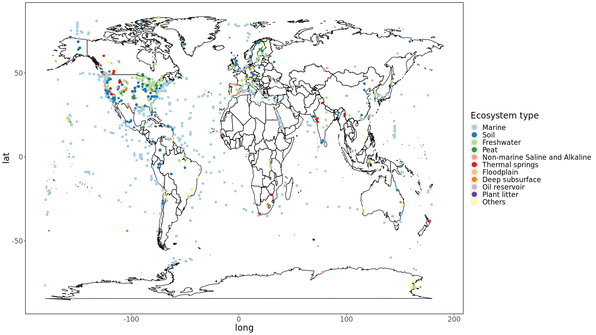

# JGI Pathway Analysis

Microorganisms play a dominant role in the biogeochemical cycles  of nutrient elements like carbon, nitrogen, and sulfur[1]. Almost all microorganisms across the globe can mineralize organic carbon into inorganic forms[2]. Microorganisms are an essential factor in regulating soil carbon dynamics and are involved in biosphere processes associated with greenhouse gases[3]. Microbial reactions control the oxidation state of nitrogen, which is essential for the availability of this relatively rare growth-limiting nutrient in many ecosystems[4]. Some microbial genera are specialists of cycling nitrogen and encode genes involved in the pathway among habitat types in soil ecosystems[5]. The microbial activities dependent transformation of organic and inorganic sulfur compounds influences the biosphere's geochemical properties[6]. Sulfate reduction is strongly linked with the oxidation of organic carbon in the anaerobic environment, but relatively few microbial lineages are involved in this progress[7]. Only a minority of microorganisms in the aquifer system can conduct full steps of redox activity of elements, and more microbes are linked by transferring redox products from one to another[1].

Microbial communities' functional and taxonomic composition  is widely different due to environmental factors among variable ecosystem types[8-9], but we have known a little about the causes of the fluctuation. The species abundance and metabolic intensity  of soil microbes in warm and moist regions are higher than those in cold and dry areas[2]. The acid sulfate soil's microbial communities are strongly influenced by the aerobic oxidation condition, with multiple sulfide oxidation gene abundances increasing[10]. The microbial communities buried in sediment can adapt to the slowly changed geochemical condition by adjusting the taxonomic and functional composition[11].  The functional structures of ocean microbial communities are intensively affected by the environmental conditions, but the taxonomic compositions change a little in each functional group[12]. Previous studies mostly focus on the variance and influence of microbial communities in representative sampling points in one typical ecosystem, which is beneficial for searching critical factors involved in the biogeochemical processes and filtering out the random noise. However, there is a lack of research comparing the taxonomic diversity and consistency of microbial function , such as redox activities, especially in the biogeochemical cycles in different ecosystem types globally. Based on the microbial abundance table from the Earth Microbiome Project (EMP) public database, a global microbial co-occurrence network with several modules involved in different environments was established[13]. The combined analysis of datasets from variable types of ecosystems provides a new perspective of the microbial distribution and interaction patterns tied to global nutrient  elements cycling at an unprecedented scale.

The microbial nucleotide sequences database's development made it possible to analyze the published metagenomic data from a bulk of samples simultaneously[14]. The Integrated Microbial Genomes & Microbiomes(IMG/M) system is a platform to annotate, analyze, and distribute microbes' genomic data stored at DOE's Joint Genome Institute (JGI) from scientific projects all over the world[15]. Based on ensembled metagenomic annotation results from 11404 samples with the environmental information provided by the IMG database, we analyzed the gene abundance about essential biogeochemical progress, especially the anaerobic process in different microbial taxons in various ecosystem types globally . Besides, we explored the correlation between gene abundances in different biogeochemical pathways and the correlation between gene abundance dissimilarities and geographic distance. The occurrence network of microbial taxons and gene abundances in different ecosystems were also founded.

[1]	Anantharaman K, Brown C T, Hug L A, et al. Thousands of microbial genomes shed light on interconnected biogeochemical processes in an aquifer system. Nature communications, 2016, 7: 13219
[2]	Crowther T W, Van den Hoogen J, Wan J, et al. The global soil community and its influence on biogeochemistry. science, 2019, 365(6455): eaav0550
[3]	Zhou J, Xue K, Xie J, et al. Microbial mediation of carbon-cycle feedbacks to climate warming. Nature Climate Change, 2012, 2(2): 106-110
[4]	Kuypers M M, Marchant H K, Kartal B. The microbial nitrogen-cycling network. Nature Reviews Microbiology, 2018, 16(5): 263
[5]	Nelson M B, Martiny A C, Martiny J B. Global biogeography of microbial nitrogen-cycling traits in soil. Proceedings of the National Academy of Sciences, 2016, 113(29): 8033-8040
[6]	Klotz M, Bryant D, Hanson T. The microbial sulfur cycle. Frontiers in microbiology, 2011, 2(241)
[7]	Anantharaman K, Hausmann B, Jungbluth S P, et al. Expanded diversity of microbial groups that shape the dissimilatory sulfur cycle. The ISME journal, 2018, 12(7): 1715-1728
[8]	Kuang J, Huang L, He Z, et al. Predicting taxonomic and functional structure of microbial communities in acid mine drainage. The ISME journal, 2016, 10(6): 1527-1539
[9]	Shade A, Jones S E, Caporaso J G, et al. Conditionally rare taxa disproportionately contribute to temporal changes in microbial diversity. mBio, 2014, 5(4)
[10]	Su J-Q, Xia Y, Yao H-Y, et al. Metagenomic assembly unravel microbial response to redox fluctuation in acid sulfate soil. Soil Biology and Biochemistry, 2017, 105: 244-252
[11]	Marshall I P, Karst S M, Nielsen P H, et al. Metagenomes from deep baltic sea sediments reveal how past and present environmental conditions determine microbial community composition. Marine genomics, 2018, 37: 58-68
[12]	Louca S, Parfrey L W, Doebeli M. Decoupling function and taxonomy in the global ocean microbiome. science, 2016, 353(6305): 1272-1277
[13]	Ma B, Wang Y, Ye S, et al. Earth microbial co-occurrence network reveals interconnection pattern across microbiomes. Microbiome, 2020, 8(1): 1-12
[14]	Stevens E L, Timme R, Brown E W, et al. The public health impact of a publically available, environmental database of microbial genomes. Frontiers in microbiology, 2017, 8(808)
[15]	Chen I-M A, Chu K, Palaniappan K, et al. Img/m v. 5.0: An integrated data management and comparative analysis system for microbial genomes and microbiomes. Nucleic acids research, 2019, 47(D1): D666-D677

